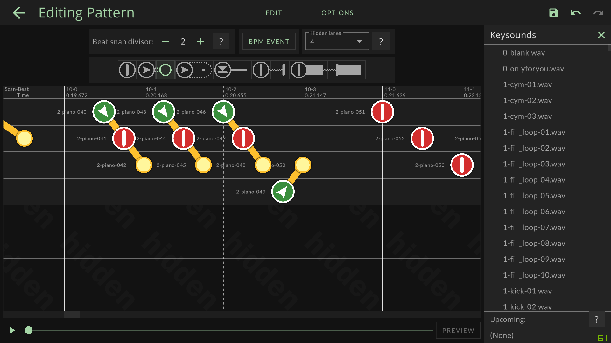
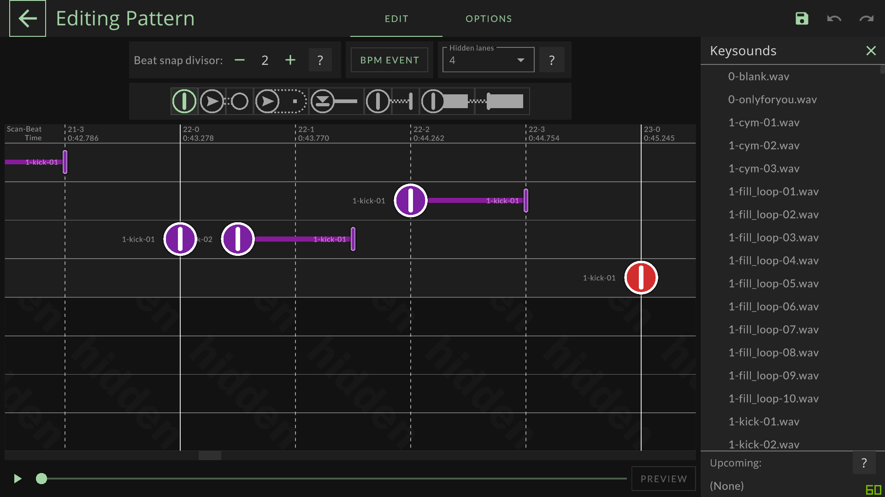

# Pattern Converter
Converter for `.bms`, `.bme` `.pt` `.bytes` and `.tech` 

## Usage (exe)
- Download latest build from [release page](https://github.com/rogeraabbccdd/PT2TECH/releases/latest).
- Drag and drop your files to exe.

## Usage (Node.js)
- Clone repository.
- Install [Node.js](https://nodejs.org/en/) and [Yarn](https://yarnpkg.com/).
- Run `yarn` to install dependencies.
- Use `yarn start <file>` to convert.

## Supported file type
- BMS file `.bms`, `.bme`
  - Will convert to `DJMAX pt txt`, `.bytes`.
  - When convert to `DJMAX pt txt` and `.bytes`, BPM change notes will be placed at track 0, normal notes will be placed at track 1 ~ 7, background notes will be placed from track 20, and will add 1 note with no keysound 1 measure after last note for track end sign.
- DJMAX file `.pt`, `.bytes`
  - Will convert to `DJMAX pt txt` and `.tech`
  - You have to create a song and empty patterns in TECHMANIA, and merge converted `.tech` file to `track.tech`, this tool only handle notes for you.
  - Drag notes angle will not be parsed, you have to edit it in TECHMANIA editor by yourself.
  - You have to fix repeat notes and chain notes after convert by yourself at this moment.  
    
    
- TECHMANIA file `.tech`
  - Will convert to `DJMAX pt txt` and `.byte`.
  - Drag notes angle will not be parsed, you have to edit it in TECHMANIA editor by yourself.
  - You have to fix repeat notes and chain notes after convert by yourself at this moment.  

## Credits
- [samnyan](https://github.com/samnyan) for `bytes_to_text.exe` and `pt_to_text.exe`
